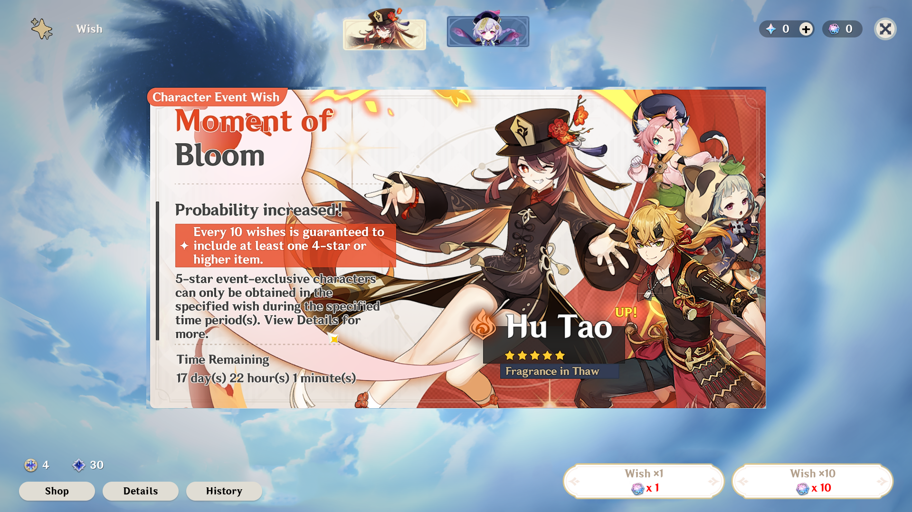

# primoprod

A Genshin Impact-inspired wish simulator written with Vue and Typescript to push a to-do list with gacha as motivation



All code is licensed under the AGPL in LICENSE.md.

Most assets are owned by MiHoYo, Co., Ltd.

## Project setup
```
yarn install
```

### Compiles and hot-reloads for development
```
yarn serve
```

Electron:
```
yarn electron:serve
```

### Compiles and minifies for production
```
yarn build
```

Electron:
```
yarn electron:build
```